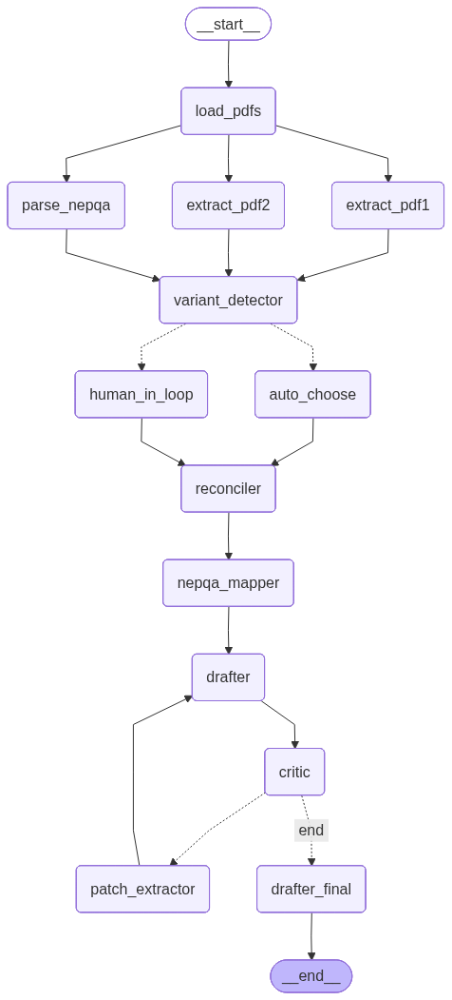

# Nepal Import Compliance Drafter

A small agent that reads two messy factory PDFs and Nepal's solar regulator checklist, then writes a draft compliance file the importer's customs agent can actually review.

Built as my Task 1 submission for Cantordust's AI Engineer take-home.

## The problem in one paragraph

A Kathmandu trader called SunBridge wants to import grid-tied solar inverters from China. The factory sends some paperwork, but it's written for China — different layouts, different terminology, sometimes for two different products mixed together. Nepal expects the inverter to be tested to a specific NEPQA 2025 checklist. Someone has to sit down, read everything, line it up against Nepal's rules, and produce one clean draft to hand to the import agent. That's tedious and easy to get wrong by hand. So I wrote an agent to do it.

The interesting twist (which I'm pretty sure is the trap Cantordust set on purpose): the two factory PDFs they handed me describe **two different products** from the same factory in Ningbo. PDF1 is a small single-phase Chisage microinverter line. PDF2 is the big three-phase Deye string-inverter line. Merging facts from both into one draft would be wrong and the import agent would catch it. So the agent has to detect the mismatch, ask which product the shipment is actually about, and only then write the draft.

## What it does

- Reads the three PDFs (`PyMuPDF`, page-indexed)
- Extracts a typed `ProductRecord` from each manufacturer doc using an LLM + Pydantic schema
- Pulls the NEPQA Section 1.4 (PV Inverter) checklist out of the regulator PDF the same way
- A **ReAct agent** classifies the relationship between the two records using 4 read-only tools and a terminal `commit_decision` tool
- If the records describe different families, the user picks which one the shipment is about (CLI prompt, or Streamlit radio)
- Reconciles the two records field-by-field, maps the chosen one to NEPQA, drafts the final markdown + PDF
- A critic node re-reads the draft and flags anything unsupported; if it finds flags, a `patch_extractor` node re-extracts only the flagged fields and the loop runs again (configurable retry budget, default 2)
- Every value in the final draft cites its source PDF and page

## Architecture



8 of the 13 registered nodes do LLM work. The other 5 (reconciler, mapper, the routers, load_pdfs) are deterministic Python. The drafter is hybrid: a Python markdown template carries every fact + (source: pdfN p.K) citation, and a small LLM call adds four short prose blocks (cover note to the import agent, methodology note, gap narrative, mismatch framing). The prose call is constrained — temperature 0, structured output, post-call guard that rejects any numeric value not present in the structured input — so the LLM can phrase but cannot fabricate. If the guard fires twice in a row, the drafter falls back to canned cover/methodology text and the deterministic core still ships.

The drafter runs twice per pipeline. The first call renders the draft for the critic to review. After the critic loop terminates, a `drafter_final` node re-runs the drafter (same function, same deterministic filename) to pick up the critic's ask-the-factory list and surface it in §8 of the draft. The two passes overwrite the same `compliance_draft_<ts>.md` / `.pdf` / `agent_state_<ts>.json` so the final files on disk are always the post-critic versions.

The variant detector wraps an LLM call but also runs a hard Python sanity check on the output: if the two records have disjoint model sets AND different family labels AND different phases, it forces a `DIFFERENT_FAMILY` verdict regardless of what the LLM said. Belt + suspenders.

## Setup

Python 3.11 or higher.

```powershell
git clone <this-repo>
cd Cantordust_Assessment

python -m venv .venv
.\.venv\Scripts\Activate.ps1
pip install -r requirements.txt

Copy-Item .env.example .env
# Open .env, paste your GEMINI_API_KEY (free at https://aistudio.google.com/apikey)
# OR set LLM_PROVIDER=groq and paste GROQ_API_KEY (also free)
```

If `pip install` chokes on WeasyPrint on Windows, just comment that line out — the agent will skip PDF rendering and still write the markdown draft. WeasyPrint needs the GTK3 runtime on Windows which is more pain than it's worth for a demo.

### Optional: LangSmith tracing

If you want to inspect every LLM call after a run:

1. Make an account at https://smith.langchain.com, grab an API key
2. In `.env`, uncomment the three `LANGCHAIN_*` lines and fill in the key
3. Restart Streamlit — the sidebar caption will flip to **🔵 LangSmith tracing ON**

Disabled by default, so a reviewer without a LangSmith account isn't affected.

## Running it

CLI:

```powershell
python run.py `
  --pdf1 data/DSS_GZES230100125901_combined-1.pdf `
  --pdf2 data/188_1115.pdf `
  --nepqa data/nepqa_2025.pdf `
  --retries 2
```

Streamlit:

```powershell
streamlit run app.py
```

Both write into `outputs/`:

- `compliance_draft_<timestamp>.md` — the actual draft
- `compliance_draft_<timestamp>.pdf` — the rendered PDF if WeasyPrint is installed
- `agent_state_<timestamp>.json` — full state dump for audit

The Streamlit version is the one to demo. It streams tokens live into each node card, shows the variant decision, asks for human input only when needed, and shows the critic's retry loop play out.

## Tests

```powershell
pytest tests/
```

There are 42 tests covering schemas, reconciler severity logic, NEPQA coverage classification, the patch-extractor retry counter, all five variant-detector tools, the ReAct agent's commit path and fallback, the hybrid drafter's prose injection + digit-leak guard (rejection of fabricated numbers + fallback to empty prose), and the submission-grade template structure (10 sections, doc-control header, ask-factory §8, sign-off block, NEPQA-as-indicative-reference disclaimer).

## Demo

Loom: _added after recording_
